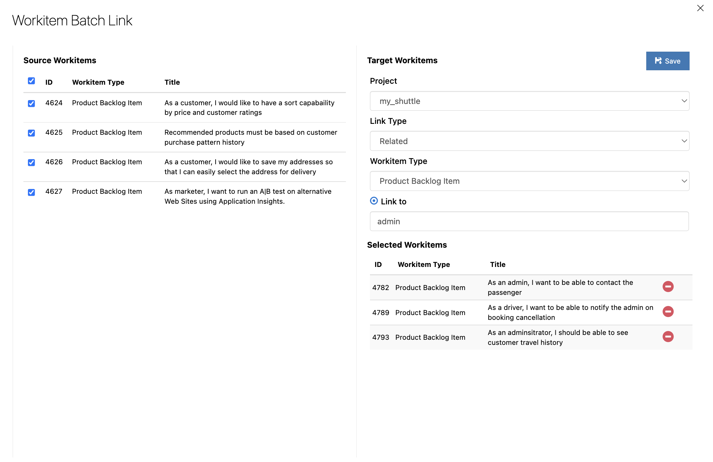
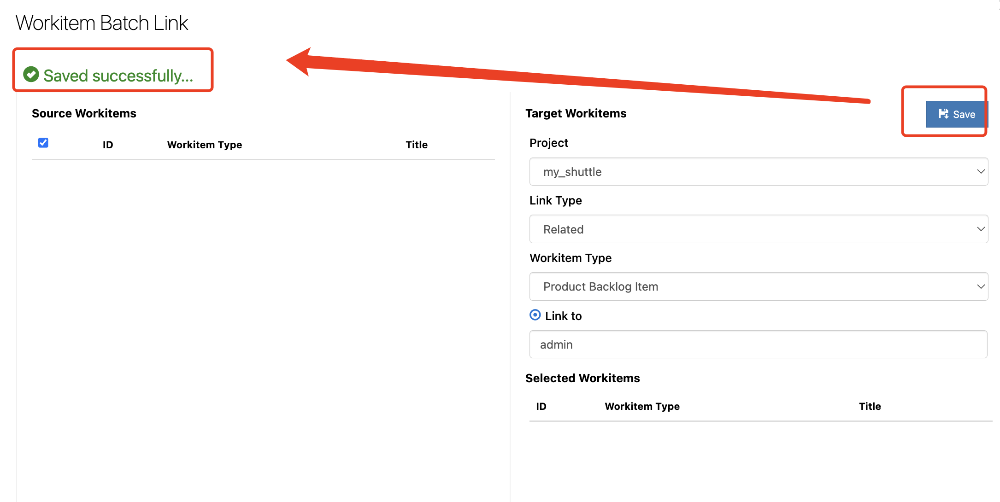

### Workitems Batch Link for Azure DevOps
---
With this extension you can easily link selected workitems to other workitems (Support Cross-project, One-To-Many and Many-To-Many relationship)

### Key Feature

|  Feature | Desc  |
| ------------ | ------------ |
| Workitem Batch Link  | Link selected work items to other workitems  |
| Cross-project  | Select target work items from another project   |
| Quick Search  | Search target work items by fields such as ID, Title, Assign To  |
| Many-To-Many  | Setup Many-To-Many relationship with just one click |

### User Guide
---

1. Select workitems from Backlogs hub or Queries page and click "Batch Link" on the right-click context menu.

2. Setup the relationship between source workitems and target workitems.

3. Select target workitems.

4. Save and Link.

5. Check links.

### Bussiness Support
---
Please feel free to contact us by email: henryli@leansoftx.com

### 工作项批量链接插件介绍
---
工作项批量链接插件，可以方便快速的将当前项目下选择的工作项与其他项目的工作项建立链接，一键建立跨项目1对1，1对多，多对多的关联关系。

### 功能列表

|  功能 | 说明  |
| ------------ | ------------ |
| 批量关联  | 批量建立项目之间工作项的关联关系  |
| 垮项目 |  在目标项目中选择需要被关联的工作项 |
| 快速检索 |可以通过工作项编号，标题，指派给等字段快速检索需要被关联的工作项|
| 批量复制工作项树 |批量复制工作项以及整个工作项树结构|
| 1对多、多对多 |一键完成1对多，多对多的关联关系|

### 使用说明
---

1. 在 "积压工作(backlog)项" 或 “查询” 页面选择需要建立链接的工作项，并点击右键菜单中的 “Batch Link”

2. 配置源工作项与目标工作项之间的链接关系。

3. 选择并确定目标工作项。

4. 保存链接关系。

5. 查看链接关系。

### 商业支持
---
如有任何问题可以通过邮件与我们联系：henryli@leansoftx.com
